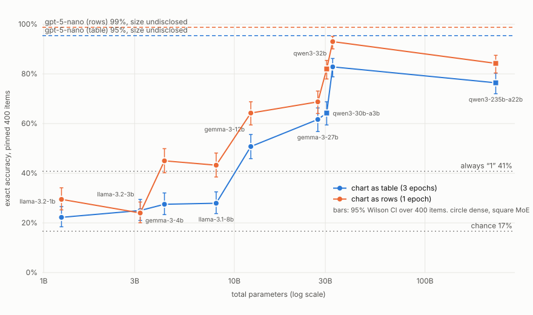

# pokemon-gen1-eval

**A narrow capability eval, built the way a safety eval is built.**

v0.1.0 · Apache-2.0 · pre-registered in [PLAN.md](PLAN.md) (commit `82c6bde`, blob `378f365` via `git hash-object PLAN.md`; not edited after this line) · addendum [ADDENDUM.md](ADDENDUM.md) (commit `8717c65`, blob `b3eee1d`; supersedes the plan's conditions, models, ceiling and P2/P4/P5/P6; not edited after this line) · replication [REPLICATION.md](REPLICATION.md) (commit `3e389fc`, blob `d6a1573`; not edited after this line) · review runs [REVIEW.md](REVIEW.md) (commit `94313fe`, blob `4faeb2b`; not edited after this line) · second review round [REVIEW2.md](REVIEW2.md) (commit `9f8f94f`, blob `4236e69`; not edited after this line) · third review round [REVIEW3.md](REVIEW3.md) (commit `a69a11b`, blob `8f0b7d2`; not edited after this line) · ledger in [FINDINGS.md](FINDINGS.md)

Six-way multiple choice on the damage multiplier when a move of one of the 15
Generation I types hits one of the original 151 Pokémon as typed in Red/Blue.
The answer key is generated from PokeAPI's tables, never typed. The chart and
the full typing list are in the prompt, so the task is find, look up, multiply:
nothing is recalled. Exact match is the score; how close a miss was is
reported beside it, never blended in.

## Status

Run, replication and review round complete, 2026-08-29. Nine open models
from 1B to 235B plus a ceiling model on the pinned 400, two chart formats;
the four knee rungs replicated on a second disjoint 400; the one truncated
rung rerun; after an external review, rows at three epochs on the four knee
rungs and the 235B MoE on a second host (REVIEW.md, O-006, O-007); after a
second review, a recall pass on all ten models, shuffled options on the two
leaning models, and temperature 0 on the 12B rung (REVIEW2.md, O-009,
O-010, D-014); after a third, a relabelled-chart pass on all ten and a
discarded no-thinking run (REVIEW3.md, O-011, O-012, D-015, D-016). $10.45
total; $2.55 of credit left. Sixteen D entries and twelve O entries. Paper draft in
`writeup/paper/` (untracked until the preprint goes up).

## Result



Exact accuracy on the pinned 400 (majority baseline 0.41, chance 0.17);
table format at three epochs with its 95% Wilson interval over items, rows
at one epoch. Full table with strata, parse rates and hosts in
`data/results/20260829_035620_curve_pinned.csv`; the reading is O-004.

| params (active) | model | table | 95% CI | rows |
|---|---|---|---|---|
| 1.2B | llama-3.2-1b | 0.22 | 0.18 to 0.27 | 0.30 |
| 3.2B | llama-3.2-3b | 0.25 | 0.21 to 0.30 | 0.24 |
| 4.3B | gemma-3-4b | 0.28 | 0.23 to 0.32 | 0.45 |
| 8.0B | llama-3.1-8b | 0.28 | 0.24 to 0.33 | 0.43 |
| 12.2B | gemma-3-12b | 0.51 | 0.46 to 0.56 | 0.64 |
| 27.4B | gemma-3-27b | 0.62 | 0.57 to 0.66 | 0.69 |
| 30.5B (3.3B) | qwen3-30b-a3b | 0.64 | 0.59 to 0.69 | 0.82 |
| 32.8B | qwen3-32b (4,096 tokens) | 0.83 | 0.79 to 0.86 | 0.93 |
| 235B (22B) | qwen3-235b-a22b | 0.76 | 0.72 to 0.80 | 0.84 |
| undisclosed | gpt-5-nano (4,096 tokens) | 0.95 | 0.93 to 0.97 | 0.99 |

With the reference as a grid, nothing under 12B reads it (quads near
zero); as rows, the knee drops to about 4B. The 30B MoE with 3.3B active
sits with the 30B dense models, on both item sets. Rows beats table for
nine of ten. Replicated on a second, disjoint 400-item set for the four
rungs around the knee (O-005): order and MoE placement hold, every model
lands within 0.05 of its first number, and "beats always-1" turned out to
depend on the item mix while "reads the chart" did not.

Without the reference (no chart, no typing list) recall scores 0.14 to
0.28 through 27B and the 30B MoE, about 0.51 at 32B and 235B, 0.665 for
the ceiling (O-009). Below 32B the ladder is measuring reading, not memory;
at 32B and above about two thirds of the hits would have come without the
reference, so those scores are a ceiling on reference-following.

Relabelling the 15 type names (memory of the real chart useless) moves
every model by less than 0.06, and lifts the contradicted cells from
0.43-0.60 to 0.52-0.82 from 12B up (O-012). The prior is a tax on the cells
it contradicts, not a subsidy on the rest; the ladder measures reading at
every rung.

## Why this task

The trap in a capability eval is breadth: a broad eval becomes a trivia game
and the number stops meaning anything. This one is narrow on purpose and
procedural on purpose. The answer is a lookup (two chart cells) and a multiply,
the key is derivable by code, and the Gen 1 chart differs from the modern chart
in exactly four cells, which gives a built-in test of whether a model follows
the table in front of it or the one it memorised.

What it cannot say is in PLAN.md and is as important as what it can.

## Build log

Every decision, in order, with what it caught. Ledger ids point into
[FINDINGS.md](FINDINGS.md). The rule throughout: nothing is measured until the
instrument has been shown to fail on a planted wrong answer.

### 1. Source, not memory (2026-08-29)

The type chart and 151 typings could have been typed from a wiki. They were
pulled from PokeAPI instead, because PokeAPI carries `type_efficacy_past.csv`
and `pokemon_types_past.csv`: the generation-specific overrides that make
"Red/Blue" mean Red/Blue (Magnemite pure Electric, Clefairy Normal, Ghost
doing nothing to Psychic). Seven CSVs frozen at commit `7af36d9`, sha256
beside them in `data/raw/`. A changed hash invalidates every number.

### 2. Derive the key, then check it by hand (D-001)

`src/key.py` builds 2,265 cells (15 x 151) with two answers each: the Gen 1
multiplier and the modern chart applied to the Gen 1 typing. 71 cells differ.
Then 26 known-answer cells were written from memory and compared. **Six were
wrong, and the key was right.** The "modern" column had been written against
modern typings (Magnemite as Electric/Steel) instead of the modern chart on
the Gen 1 typing, and Grass vs Gyarados is 2 x 1/2 = 1, not 1/2.

Lesson: the verification list is written by a person and is as fallible as the
thing it verifies. When they disagree, check both. This time the person lost.

### 3. Pin the item set before any run

400 cells, seed 0, stratified by difficulty: every `differs` cell (71, taken
whole), then immunities, 4x/¼x, ordinary dual-type, ordinary single-type. The
file is committed and a test holds the draw to it byte for byte.

Why stratify by answer difficulty and not by type: the question is whether the
model multiplies, and the strata are where multiplying matters. The cost of
that choice is item 6 below.

### 4. Negative-test the scorer

`inspect_ai.scorer.choice()` is a regex for `ANSWER: X` and a letter compare.
Before trusting it: a mock model answering the key scores 1.0, one answering
key+1 scores 0.0, one that stops mid-reasoning scores 0.0 with
`parse_failures` = 1.0. A scorer that cannot fail is not a scorer.

### 5. A dev set, declared (D-002)

PLAN.md pinned one set and said nothing about where the harness gets debugged.
Running the first live model on the registered set with an untried scorer
would have been the wrong order. 100 cells drawn from the 1,865 the pinned set
did not use; zero overlap by construction; no `differs` cells because the
pinned set holds all 71. Nothing measured on it is reported against a
prediction.

### 6. Attack types were not even (D-004)

Checked the class balance before running: answer classes are skewed to 1x
(41%) because most cells in the game are neutral, which is fine as long as
the majority baseline is printed beside every accuracy. But attack types in
the pinned set run 13 (Rock) to 45 (Bug), because the 71 `differs` cells are
all Bug/Poison/Ghost/Ice attacks, and the first dev draw had **no Bug and no
Poison attacks at all**, by chance. The pinned set stays (registered) and
per-type accuracy on it is read with n; the dev set was redrawn round-robin
across types within each stratum. Immunities and quads cannot be evened: 14
and 34 cells were left, and quad is half Grass because that is where the
game's 4x cells are.

Also caught here: a commit went through with a failing test because
`pytest | tail` hid the exit code. Amended. Run pytest bare.

### 7. The prompt (D-003)

Three changes before any run, each with a reason:

- **Reasoning allowed.** The first draft forced the whole response to be
  `ANSWER: X`, which turns condition B into a silent lookup-and-multiply and
  penalises a non-thinking model for a reason unrelated to the chart. Now
  Inspect's chain-of-thought template (think, then `ANSWER: X` on the last
  line), `max_tokens` pinned at 1024, and `parse_failures` reported so a
  truncation is its own number and not folded into "wrong". `-T cot=false`
  gets the silent version back as a later comparison.
- **The game's words as the mapping.** Red/Blue never printed a multiplier;
  it printed "super effective", "not very effective", "doesn't affect". The
  numbers are the community's. The system prompt gives the mapping and says
  that two types multiply, so 1/4 and 4 are legal answers, and says what to
  ignore (STAB, stats, move power, move-specific exceptions).
- **An unambiguous chart instruction.** Condition C says "use only the chart
  below, even where it disagrees with what you remember about the games."
  Without that, a miss on a `differs` cell could be a reasonable resolution
  of a conflict with the system prompt instead of an instruction-following
  failure, and P4 would not mean what it says.

Answer format stays numeric (0, 1/4, 1/2, 1, 2, 4) rather than the game's
words: the words collapse 4x into 2x and lose the multiply step, which is the
`quad` stratum and the point of the task.

### 8. Metrics that answer different questions

In the log, from Inspect: `accuracy`, `stderr`, `parse_failures`, and accuracy
by stratum, by answer class, by attack type. In `src/analyze.py`, from the
log: the epoch range (the noise band P1 is scored on), chance and majority
baselines on the same line as every accuracy, the confusion matrix in
multipliers (a 4 scored as 2 is a multiply failure; a 4 scored as 1 is a
lookup failure), the predicted-letter distribution (fixed A–F order makes
position bias measurable), and under `chart=modern` the split on `differs`
cells: followed the table / followed the prior / neither.

Analyze is negative-tested too: an always-"1" mock must come back with
accuracy equal to the majority share, only letter D predicted, and 0.0 on
immune and quad.

### 9. The budget did the multiplication the plan skipped (D-005)

Pricing the registered grid honestly: ~19,200 calls, ~$157 at list price,
against $7 of OpenRouter credit and a plan that said $30. Same failure as
data-deltas D-003 (a batch size nobody multiplied out). Rather than shrink
the item set, the question got narrower and better:

- **One condition.** The chart and the full 151-line typing list go in the
  system prompt; the question names only the attacker's type and the
  defender. Find it in the list, read two cells, multiply. That is the
  skill; nothing else is being measured. The recall conditions stay in the
  code as parameters and are not run, and P2/P4/P5/P6 retire unmeasured.
- **Four models, four labs**, chosen by price from OpenRouter's public list:
  Haiku 4.5 (batch route), GPT-5 nano, Gemini 2.5 Flash-Lite, Qwen3 235B.
  Three epochs each on the pinned 400, projected under $4 total. Cross-lab
  under one prompt is worth more here than Sonnet and Opus would have been.
- **Closeness, beside exact match and never blended with it.** Bucket match
  is the game's own word (doesn't affect / not very / normal / super
  effective); steps off is distance on the log2 scale, with immunity three
  steps from everything because it is a rule, not a magnitude. The reason
  to keep the two apart: a 2 answered as 4 is "close" by word and is exactly
  the multiply failure the quad stratum exists to catch. Three addendum
  predictions (A1 to A3) are registered in the ledger before any run.

Caught while wiring it: a task-level `metrics=` list applies to every
scorer, so `closeness` was silently reporting `accuracy`. Metrics now live
on each scorer. A dict-valued score surfaces as separate entries (`bucket`,
`steps`) in the log; the analyze script reads them from there.

### 10. First model call: Haiku on the dev set (O-001, D-006)

100 items, one epoch, $0.39. Exact 0.84, bucket 0.85, zero parse failures,
no position lean. Then the 16 misses were read one at a time, and the
finding was not the one predicted: **14 of 16 are the chart read
transposed.** The model says "row: Ground, column: Electric" and reports
Electric-attacking-Ground. Zero wrong-Pokemon lookups in 100, zero multiply
errors. The list is found and the arithmetic is fine; the 15 x 15 markdown
table is what breaks.

Why a model does that: a pipe table makes it count across 16 columns, and
its prior stores the relation defender-first ("Electric is weak to
Ground"), so once it holds the pair it retrieves the memorised direction.
Symmetric cells hide the swap; only the asymmetric ones show it.

Two things follow. A second chart format, one line per attacking type, is
registered as a variant with its own prediction (A6: the format is the
finding), run beside the table and never instead of it. And the table
costs 3,032 input tokens per call, double the addendum's estimate, so Haiku
moves to the half-price batch route and the cheap models carry both
formats.

### 11. The other three, both formats, on the dev set (D-007, D-008, O-002)

Cheap models next, ~$0.30 for six runs. gpt-5-nano came back at 0.69 with
30% parse failures: a reasoning model that spent the 1,024 budget thinking
and never wrote the answer line. The 5% rule fired, nano reruns at 4,096:
0.98 in both formats. The metric earned its place on the first day.

Then the format question, which was the question you asked: chart or
model? Rows beats table for every model. For Haiku, the table misses were
the grid (10 of 16 full-mirror answers; 2 of 4 under rows) and rows takes
it to 0.96. For Gemini Flash-Lite, 20 of 29 asymmetric misses are still
the mirror cell under rows, where there is no axis to confuse; that is the
model's stored relation winning over the line in front of it. Same
symptom, two causes, and the second format is what separates them.

Also caught: my hand count of Haiku's transpositions (14 of 16) and the
code's (10 of 16) use different definitions. Both kept and named (D-008).

### 12. Two Siri-sized models, and the provider behind the provider (D-009, O-003)

Added `llama-3.2-3b-instruct` and `gemma-3-4b-it`, the on-device class. The
first llama run read 0.17 with 31% parse failures cut mid-word. Not the
token budget: the raw responses showed OpenRouter had split the run across
two hosts and one of them was returning HTTP 500 mid-generation, scored as
wrong answers. Pinned to the healthy host: 0.18 in both formats, which is
chance. gemma: 0.26 table, 0.34 rows, below always-answering-"1".

Analyze now records the upstream host per call. That census showed the Qwen
runs had been served by ten different hosts. For the pinned runs every
model is pinned to one host and the host is in the results file: the host
is part of the instrument.

### 13. The size ladder (D-010)

The frontier tier clears this and the 3B class does not, so the question
became "how small a model can do find, look up, multiply over a reference
in context." Nine models, two dense families (Llama 1→3→8, Gemma 4→12→27)
plus Qwen for the MoE question (30B with 3.3B active against 32B dense,
and 235B with 22B active), and nano as the ceiling. One host per model,
bf16 wherever a host offers it, all in `src/models.py` with published
parameter counts. `analyze` writes the curve as a CSV with stderr and
epoch range per point; the plot is drawn from that file, not by hand.
Prediction A7: monotone within family, active params predict the MoE.

### 14. The curve (O-004, D-011, D-012)

Nine models on the pinned 400, table at three epochs, rows at one, $4.21
total. The knee is between 8B and 12B with the chart as a grid: nothing
under 12B beats always answering "1", and quads are near zero there. With
the chart as rows the knee drops to about 4B. The 30B MoE with 3.3B active
sits with the 30B dense models, so the limit is not compute per token.
Rows beats table for nine of ten, by up to +0.23 (qwen3-32b, 0.70 to
0.93). Predictions: P1, P3 and the accuracy half of A6 held; A1, A4, A5,
A7's MoE clause and the transposition halves of A6 and A2 failed, each in
a way the ledger reads out.

Two harness entries on the way. The in-log parse-failure metric is wrong at
`epochs > 1` (Inspect's reduction drops the answer field); analyze was
right all along and a `parsed` scorer with a numeric value now fixes the
log too. And qwen3-32b, a thinking model, truncated 14% of its table calls
at 1,024 tokens; its table number is kept as a floor rather than rerun,
because the wallet said so.

### 15. Intervals, and a viewer column that was not the headline

The Inspect task list shows one metric per run and, with thirty attached
to the exact scorer, it picked a grouped one: gemma-3-12b showed 0.968
where its accuracy is 0.642. The in-log metrics are now just accuracy, a
95% Wilson interval, stderr and the one-epoch parse-failure number; every
grouping moved to `analyze`, with n and its own interval. The interval
uses n = items, not items times epochs, because repeats of one item are
not independent trials. One function in `src/stats.py` computes it for
the log and for the results file, so the two never disagree. The curve
now carries CI bars: the eight rungs from 12B up are separated from the
four below by more than their intervals; 27B, 30B-A3B and 32B overlap
each other under table.

### 16. Replication and the last rerun (O-005, D-012 closed)

Registered in REPLICATION.md before running: a second 400-item set (the
dev 100, never shown to these four, plus 300 new cells; no immunities
were left to draw, so this set's majority is 0.478 against 0.408), the
four rungs around the knee, table, three epochs. Order held, the MoE's
placement held, and every model landed within 0.05 of its pinned number.
The one clause that failed is the one worth knowing: 12B tied this set's
majority instead of beating it. "Reads the chart" replicated; "beats the
dumbest strategy" was a property of the item mix.

qwen3-32b rerun at 4,096 tokens: 0.697 became 0.828, one truncated call
in 1,200. A 0.13 swing from the token budget alone. The old log is in
`logs/superseded/`; the curve carries the new point.

### 17. Two reviews, five registered runs (O-006, O-007, O-009, O-010, D-014)

Both external reviews of the draft asked the same first question: where is
the recall condition? Everything so far had the reference in the prompt,
and nothing but the 71 contradicted cells separated reading from
remembering. REVIEW.md registered rows at three epochs (V1, V2 held) and a
second host for the 235B MoE (V3 held, at the edge: hosts differ by 0.04).
REVIEW2.md registered the recall pass, a shuffle, and a temperature-0 run,
with five predictions, before spending.

The recall pass is the one that changes how the paper reads. Nobody under
32B remembers the Generation I chart well enough to beat "always 1"; the
score at those rungs is reading. At 32B and 235B roughly two thirds of the
table hits also come from memory, and the ceiling model gets 0.83 of them
without the reference. The prediction that memory would grow with size was
half right: gemma-3-27b and qwen3-30b-a3b read the chart well and remember
almost none of it (W2 failed there).

The shuffle run said the small-model lean is to the value "super
effective", not to the letter E (W4, value clause). Its letter clause could
not be scored: Inspect's `shuffle=True` rewrites the logged prompt and
completion to look unshuffled and keeps only the mapped value, so the
shown order and the reasoning are gone from the log (D-014). Shuffle at
dataset load next time. Temperature 0 on gemma-3-12b: 0.502 against 0.507
at the host default, range 0.015 (W5 held).

```
python -m src.run_ladder --formats table --chart none --show-types false --log-dir logs/recall
python -m src.run_ladder --only gemma-3-4b,llama-3.2-3b --formats table --epochs 1 --shuffle --log-dir logs/shuffle
python -m src.run_ladder --only gemma-3-12b --formats table --temperature 0 --log-dir logs/temp0
python -m src.recall_join      # W2: table hits also hit by recall, on the 329 agreeing items
```

### 18. Third review: relabel the chart, try to turn thinking off (O-011, O-012, D-015, D-016)

The third review asked whether the MoEs had run with thinking (they had
not: `-2507` instruct variants, zero reasoning blocks; the 32B reasoned on
every call, O-011) and for a chart nobody could have memorised. REVIEW3.md
registered both. The relabelled chart (`chart=permuted`: a seeded derangement
of the 15 type names in the chart, the list and the question, key unchanged)
moved no model by more than 0.06 and raised the contradicted cells at every
rung from 12B up. X1 held 5 of 7, X2 failed in the direction that helps the
paper, X3 held. The no-thinking run was ignored by the host (reasoning on
1,200 of 1,200 calls) and discarded as the registration said (D-016). And
the first launch failed on a guard the unit test did not cover (D-015).

```
python -m src.run_ladder --formats table --chart permuted --epochs 1 --log-dir logs/permuted
python -m src.run_ladder --only qwen3-32b --formats table --max-tokens 1024 --no-thinking --log-dir logs/nothink
```

### 19. Next

Submit: LIGHT (long, 9 pages, non-archival) first, preprint alongside.
Publish the repository. Not run: gemma-3-1b (not served), a second MoE
family, the reference nobody has seen.

## Reproduce

```bash
python -m venv .venv && .venv/Scripts/activate      # the global env's openai SDK is too old for Inspect's OpenRouter provider
pip install -r requirements.txt
python -m src.key                                   # build the key, print the 26 known cells
python -m src.sample --n 400 --seed 0               # pin the item set (reproduces the committed file)
python -m src.sample --n 100 --seed 1 --exclude items_s0_n400.csv --no-differs --tag dev --balance
python -m src.export_dino && dinostomp stomp data/processed/items_s0_n400_dino.jsonl   # at-rest audit, no spend
pytest                                              # 21 tests, no API calls, about 25 s

# one model on the dev set (OPENROUTER_API_KEY in .env, which is gitignored)
inspect eval src/task.py -T items=dev_s1_n100.csv --model openrouter/google/gemma-3-4b-it \
  -M 'provider={"order":["DeepInfra"],"allow_fallbacks":false}' --log-dir logs/dev
python -m src.analyze --log-dir logs/dev
inspect view --log-dir logs/dev

# the ladder on the pinned set: table x3 epochs for every model in src/models.py, then rows x1
python -m src.run_ladder                            # about $3.20; --only 3b,4b to subset, --formats rows
python -m src.analyze --log-dir logs/pinned         # results JSON + curve CSV, with 95% CIs
python -m src.plot_curve                            # curve SVG from the latest curve CSV
```

Defaults are the registered condition (`chart=gen1`, `show_types=list`,
`chart_format=table`). Other parameters: `-T chart_format={table,rows}`,
`-T chart={none,gen1,modern}`, `-T show_types={list,inline,false}`,
`-T items=<csv in data/processed>`, `-T cot={true,false}`, `-T max_tokens=N`.
Pin the upstream host with `-M provider=...` (D-009); the hosts used are in
`src/models.py`.

## How to read a run

1. `parsed` (its mean) first, or `parse_failures` on a one-epoch run.
   Anything below 1.0: open those samples. Truncation, host errors and
   format drift are harness problems, not model findings.
2. `accuracy` with its `ci95_low` / `ci95_high` (Wilson, n = items, since
   epoch repeats are not independent trials) against the two baselines. A
   number whose interval covers the majority share has not beaten "1".
   Two models whose intervals overlap have not been separated.
3. Strata. `single` is a one-cell lookup; `dual` is two cells and a multiply;
   `quad` and `immune` are where the multiply has to be right; `differs`
   (pinned set only) is where Gen 1 and modern disagree.
4. Confusion matrix. Where do the misses land?
5. Predicted letters. Fixed order means a lean toward D is a lean toward "1".
6. Epoch range before any comparison between conditions or models. If the
   difference is inside the band, or inside both intervals, it is not a
   difference.

The viewer's task-list SCORE column shows one metric per run; with the
trimmed metric list that is `accuracy`. On logs written before 2026-08-29
03:30 it was one of the grouped metrics and is not the headline: open the
run.

## Layout

```
PLAN.md              the pre-registration; not edited after its hash is recorded
ADDENDUM.md          the re-registration after the budget arithmetic; same rule; item-set balance pass inside
REPLICATION.md       the registered replication: a second 400-item set, four knee models, R1-R4
FINDINGS.md          the ledger: D defects, O observations, N negative results
src/key.py           Gen 1 chart + typings -> 2,265-cell key; the 26 known-answer cells
src/sample.py        stratified, seeded draw; --exclude, --no-differs, --balance for dev sets
src/task.py          the Inspect task: rules + chart + typing list, six fixed options, CoT, two scorers
src/models.py        the ladder: params (total, active), quant, pinned host, token budget
src/run_ladder.py    runs the ladder on the pinned set, one inspect eval per (model, format)
src/analyze.py       logs -> results JSON + scaling-curve CSV in data/results/
src/plot_curve.py    curve CSV -> SVG (exact vs log params, both formats, 95% CI bars, baselines)
tests/               key, sampler, prompt, scorer and analyze, each negative-tested
data/raw/            PokeAPI CSVs frozen at commit 7af36d9, sha256 beside them
data/processed/      the key, its manifest, the pinned set, the dev set
data/results/        analyze output, one file per run of the script
logs/                Inspect logs (gitignored)
```

## Source and license

Three things with three licenses, the same split as the other case studies:

- **Code** (`src/`, `tests/`, the scripts): Apache-2.0, `LICENSE`.
- **Data.** The seven CSVs in `data/raw/` are PokeAPI's, BSD-3-Clause
  (`data/raw/POKEAPI_LICENSE.md`), and everything derived from them (the key,
  both item sets, the prompts) keeps that attribution; see `NOTICE`.
- **Reports and the ledger** (`README.md`, `FINDINGS.md`, `PLAN.md`,
  `ADDENDUM.md`, `REPLICATION.md`, `REVIEW.md`, `writeup/`): CC BY 4.0.

Pokémon and Pokémon character names are trademarks of Nintendo / Creatures
Inc. / GAME FREAK inc., used here to identify the game data being measured;
this repository is not affiliated with or endorsed by them.
